# Axiom RESET: The Egypt AI Operating System 🇪🇬


[](https://cloud.google.com)
[](https://github.com/Moeabdelaziz007/aix-format)
[](https://solana.com)

> **"A Hybrid Ecosystem: Consumer Marketplace & Business OS."**  
> We combine a Zero-Commission Marketplace for daily needs (Food, Meds, Housing) with AI Operating Tools for factories and education.

🌐 **Live:** [axiomid.app](https://axiomid.app)

---

## 🏗️ The Hybrid Architecture

### A. Consumer Marketplace (Like Talabat, 0% Commission)

*Centralized platform where users browse listings and place orders.*

| Agent | Sector | Function | Pricing |
|:------|:-------|:---------|:--------|
| **Sofra** 🍽️ | Restaurants | Food Aggregator: Order with AI menu & kitchen dispatch | $1.99/mo |
| **Dr. Moe** 💊 | Pharmacies | Pharma Network: Upload prescription, find stock, deliver | $1.99/mo |
| **Aqar** 🏠 | Real Estate | Housing Platform: Student & Sahel rentals, no brokers | $1.99/mo |

### B. Business OS (SaaS Tools)

*Dedicated AI workers for specific industries.*

| Agent | Sector | Function | Pricing |
|:------|:-------|:---------|:--------|
| **Tajer** 🏭 | Factories & Home Biz | AI Salesman: B2B connections + Smart AI Stores | **$4.99/mo** |
| **Ostaz** 📚 | Students | AI Tutor: Personalized curriculum per subject | $2.99/subject |

### C. Logistics Layer (Infrastructure)

| Agent | Sector | Function | Pricing |
|:------|:-------|:---------|:--------|
| **Tirs** 🛵 | Fleet | Delivers for Sofra, Dr. Moe, Tajer | **FREE** (100% to driver) |

---

## 💰 Business Model

| Plan | Price | Target | Features |
|:-----|:------|:-------|:---------|
| **App Listing** | $1.99/mo | Restaurants, Pharmacies, Rentals | 0% Commission, Listed on Axiom App, Tirs Delivery |
| **Tajer Store** | $4.99/mo | Factories, Home Business | AI-Powered Web Store, B2B Agent, Inventory AI |
| **Pro Brand** | $9.99/mo | Growing Businesses | Custom Domain + White-label Chatbot |
| **Ostaz** | $2.99/subject | Students | AI Private Tutor per subject |
| **Tirs Driver** | FREE | Delivery Drivers | Keep 100% of delivery fees |

---

## 🤖 Agent Details (AIX Format)

### 🍽️ Sofra - Restaurant OS

| Property | Value |
|:---------|:------|
| **Type** | Marketplace Listing |
| **Soul** | "Every meal is a moment of joy" |
| **MCP Servers** | `mcp-google-maps` (12ms), `mcp-whatsapp` (8ms), `mcp-stripe` (15ms) |
| **Wallet** | `SoFra88XbPZBLRxeN6q76P93iog6qGdLAiK839d6g` |

### 🏭 Tajer - Smart Store Builder

| Property | Value |
|:---------|:------|
| **Type** | SaaS Tool |
| **Soul** | "Every product finds its buyer" |
| **Features** | B2B Negotiation, AI Store Builder, Inventory Management |
| **MCP Servers** | `mcp-document-ai` (18ms), `mcp-bigquery` (22ms), `mcp-stripe` (15ms) |
| **Wallet** | `Tajer99YcQZCMSxfN7r87Q04kph7rH3MBjL950e7h` |

### 🏠 Aqar - Housing Platform

| Property | Value |
|:---------|:------|
| **Type** | Marketplace Listing |
| **Soul** | "Your perfect home awaits" |
| **Markets** | Cairo University Area, Sahel, Sharm El Sheikh |
| **MCP Servers** | `mcp-contracts` (PDF Gen), `mcp-google-maps` |

### 💊 Dr. Moe - Pharmacy AI

| Property | Value |
|:---------|:------|
| **Type** | Marketplace Listing |
| **Soul** | "Health is the greatest wealth" |
| **MCP Servers** | `mcp-vertex-medlm` (25ms), `mcp-vision-ai` (20ms) |
| **Wallet** | `DrMoe77AbNOPQRxgM8s98R15lqi8sI4NCkM061f8i` |

### 🛵 Tirs - Zero-Commission Fleet

| Property | Value |
|:---------|:------|
| **Type** | Infrastructure |
| **Soul** | "The machine runs on precision" |
| **Driver Earnings** | **100% of delivery fees** |
| **MCP Servers** | `mcp-iot-core` (8ms), `mcp-pubsub` (5ms) |
| **Wallet** | `Tirs66WdMKLNOPyHK9t09S26mrj9tJ5ODlN172g9j` |

### 📚 Ostaz - Education AI

| Property | Value |
|:---------|:------|
| **Type** | SaaS Tool |
| **Soul** | "Every student can shine" |
| **MCP Servers** | `mcp-gemini-pro` (15ms), `mcp-youtube-api` (18ms) |
| **Wallet** | `Ostaz55VeLIJMNxGJ0u10T37nskon6PEEK283h0k` |

---

## 🛠️ Technical Architecture

### AIX Format (Digital DNA)

```yaml
meta:
  version: "0.5.0"
  id: "agent-tajer-v2"
  name: "Tajer"
  type: "saas_tool"  # or "marketplace_listing"

identity:
  soul: "Every product finds its buyer"
  superpowers: ["B2B Negotiation", "Store Builder", "Arabic Dialects"]

economics:
  network: "solana-mainnet"
  wallet_public_key: "Tajer99YcQZCMSxfN..."
  pricing_model:
    type: "monthly"
    rate: 4.99
    currency: "USD"
```

### Google Cloud Stack

| Service | Usage |
|:--------|:------|
| **Vertex AI (Gemini 2.0)** | Multimodal reasoning |
| **Cloud Speech-to-Text** | Egyptian Arabic voice |
| **Google Maps Platform** | Route optimization |
| **Document AI** | Contract generation |
| **Vision AI** | Prescription OCR |

---

## 🏗️ Architecture Diagram

```mermaid
graph TD
    %% Users
    User((👤 Consumer)) -->|Browse & Order| Marketplace[📱 Axiom Marketplace]
    Merchant((🏪 Business)) -->|Build Store| SaaS[💼 Axiom Business OS]
    Driver((🛵 Driver)) -->|Deliver| Tirs[🚚 Tirs Fleet]
    
    %% Marketplace Flow
    subgraph "Marketplace - $1.99/mo"
        Marketplace --> Sofra[🍽️ Sofra]
        Marketplace --> DrMoe[💊 Dr. Moe]
        Marketplace --> Aqar[🏠 Aqar]
    end

    %% SaaS Flow
    subgraph "Business OS - $4.99/mo"
        SaaS --> Tajer[🏭 Tajer Store]
        SaaS --> Ostaz[📚 Ostaz]
    end

    %% Google Cloud Core
    subgraph "Google Cloud"
        Sofra --> Vertex[🧠 Vertex AI]
        DrMoe --> Vertex
        Tajer --> Vertex
        Vertex --> MCP[🛠️ MCP Servers]
    end

    %% Delivery Layer
    Sofra --> Tirs
    DrMoe --> Tirs
    Tajer --> Tirs

    %% Economics
    subgraph "Solana Network"
        Tirs -->|100% Fees| DriverWallet[💰 Driver Wallet]
        Marketplace -->|$1.99| Treasury[🏦 Axiom Treasury]
        SaaS -->|$4.99| Treasury
    end

    %% Styles
    style Vertex fill:#4285F4,stroke:#fff,color:#fff
    style Treasury fill:#9945FF,stroke:#fff,color:#fff
    style Tirs fill:#00ffaa,stroke:#333,color:#000
```



---

## 🚀 Roadmap 2026

### Phase 1: Foundation ✅

- [x] Platform Build & AIX Standard
- [x] "Arc Reactor" UI & Agent Cockpits
- [x] Hybrid Model (Marketplace + SaaS)

### Phase 2: Egypt Launch

- [ ] Tajer Store Builder Launch
- [ ] Onboard 500 Cairo Drivers
- [ ] **Google Cloud for Startups** 🎯

### Phase 3: MENA Expansion 🌍

*Digitizing the region's most critical underserved sectors*

| Agent | Sector | Mission | Google Tech Needed |
|:------|:-------|:--------|:-------------------|
| 🌾 **Falah** | Agriculture | Crop disease detection, yield optimization | Earth Engine, Vision AI, TensorFlow Edge |
| ✈️ **Murshid** | Tourism | AR tour guide, real-time translation | Maps Immersive View, Cloud Translation |
| 🔧 **Sanay3y** | Skilled Trades | AI diagnostics for plumbers, electricians | Vision API, Maps Routing |

---

## 📁 Project Structure

```
axiom-reset-2026/
├── web/                           # Next.js Frontend
│   └── src/app/
│       ├── page.tsx              # Orbital Selector + Pricing
│       ├── about/page.tsx        # The Story
│       └── agents/[id]/page.tsx  # Agent Cockpit
├── docs/
│   └── GOOGLE_STARTUP_APP.md     # Pitch Deck
├── agents/                        # Python Agents
└── README.md
```

---

## 👤 Founder

**Mohamed Hossameldin Abdelaziz (Amrikyy)**  
Full Stack AI Architect • Cybersecurity @ Kennesaw State University

📧 <amrikyy@gmail.com> • 📱 +1 770 616 0211

---

**© 2025 Axiom RESET** | Built in Cairo 🇪🇬 | Powered by Google Cloud ☁️
